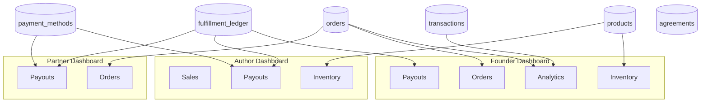

# ReadMart Dashboards Technical Documentation

This document provides a comprehensive technical audit of the Founder, Author, and Partner dashboards within the ReadMart platform.

---

## 1. Structural Analysis

### 1.1 Founder Dashboard

**Location**: `src/pages/dashboard/FounderDashboard.tsx`  
**Route**: `/founder-dashboard`  
**Access**: `ProtectedRoute` with `allowedRoles={['founder', 'admin']}`

#### Layout Structure
- **Sidebar**: Fixed left sidebar (w-72) with branding, tab navigation, and Global Sync button
- **Main Content**: Right-side scrollable area with tab-specific content
- **State**: `activeTab` (default: 'analytics'), `isLoading`, `data` object holding all dashboard data

#### Tabs and View Components
| Tab ID | Label | View Component | Purpose |
|--------|-------|----------------|---------|
| analytics | Analytics | AnalyticsView | Platform-wide KPIs, revenue trends, sales trajectory, category stats, top products |
| inventory | Inventory | InventoryView | Product catalog CRUD, categories, approved authors |
| orders | Orders | OrdersView | Order list, status updates, customer info |
| users | Users | UsersView | User profiles, role management |
| settings | Global Logic | SettingsView | Site-wide settings (tax, currency, maintenance, announcements, membership) |
| identity | Identity | IdentityView | Site name, logo, contact info |
| banners | Banners | BannersView | CMS banners management |
| author_of_day | Author of the Day | AuthorOfDayView | Featured author, books selection, custom image |
| shipping | Shipping Methods | ShippingView | Shipping zones CRUD |
| areas | City/Area Management | AreasView | Shipping zone areas |
| inquiries | Inquiries | InquiriesView | Contact messages |
| clubs | Clubs | ClubsView | Book club CMS content |
| events | Events | EventsView | Events CMS content |
| agreements | Agreements | AgreementsView | Partnership/author applications, protocol templates |
| promos | Promos | PromosView | Promo campaigns, status toggles |
| newsletter | Newsletter | NewsletterView | Subscriber list, status, export, Steme sync |
| payouts | Payouts | PayoutsView | Fulfillment ledger, Disburse button |

#### Navigation
- Navbar: Role-based link ("Founder Hub") when `profile?.role === 'founder'` or `admin`
- Realtime: Supabase channels for orders, products, profiles, banners, book_clubs, events, announcements, shipping_zones, applications, contact_messages, newsletter_subscriptions

---

### 1.2 Author Dashboard

**Location**: `src/pages/dashboard/AuthorDashboard.tsx`  
**Route**: `/author-dashboard`  
**Access**: `ProtectedRoute` with `allowedRoles={['author', 'admin', 'founder']}`

#### Layout Structure
- Single-page scrollable layout (no sidebar tabs)
- Header: Avatar, title "Author Hub", CTA "Submit New Manuscript"
- Metric tiles (4): Published Books, Total Royalties, Total Sales, Reader Reviews
- Main grid: 2/3 left (charts, publications, reviews), 1/3 right (Author Excellence card, Royalty Ledger)
- Sections: Sales Performance (BarChart), My Publications table, Reader Feedback, Royalty Ledger, Payment Methods, Agreements

#### Widgets
- **Stats**: `stats` useMemo from payouts, myBooks, salesReport, reviews
- **Sales Performance**: BarChart (recharts) from `performanceData` (monthly sales)
- **My Publications**: Table of myBooks with per-book earnings, Edit button
- **Reader Feedback**: Reviews slice with star rating, comment
- **Author Excellence**: Static incentive card ("top 5%"), "View Milestones" CTA (not wired)
- **Royalty Ledger**: Pending/Processing/Paid buckets, recent payouts
- **Payment Methods**: M-Pesa add/delete/set default
- **AgreementsSection**: Shared component, type="author"

#### Modals
- Manuscript upload/edit modal: form for title, price, category, cover, ebook file

---

### 1.3 Partner Dashboard

**Location**: `src/pages/dashboard/PartnerDashboard.tsx`  
**Route**: `/partner-dashboard`  
**Access**: `ProtectedRoute` with `allowedRoles={['partner', 'admin', 'founder']}`

#### Layout Structure
- Single-page scrollable layout
- Header: "Partner Portal", Contact Founder, Request Payout (not wired)
- Metric tiles (4): Active Shipments, Delivered (Total), Total Earnings, Performance Score (98% - static)
- Main grid: 2/3 left (Active Assignments table, Partner Resource Library), 1/3 right (Commission Ledger, Service Alerts, SLA bars)

#### Widgets
- **Active Assignments**: Orders table with search, status, address
- **Partner Resource Library**: Static cards (Shipping Guidelines, Partner Brand Assets) - links not wired
- **Commission Ledger**: Pending/Processing/Paid buckets, recent payouts
- **Service Alerts**: Static placeholder (Heavy Rain Alert, System Update)
- **SLA**: Static progress bars (ON-TIME DELIVERY 98%, CUSTOMER RATING 4.9/5.0)
- **Payment Methods**: Same M-Pesa flow as Author
- **AgreementsSection**: Shared component, type="partner"

---

### 1.4 Shared Components
- **AgreementsSection**: `src/components/dashboard/AgreementsSection.tsx`  
  - Props: `userId`, `type: 'author' | 'partner'`  
  - Fetches agreements via `getUserAgreements`, upload via `uploadAgreementFile`, submit via `submitSignedAgreement`  
  - Modal: PDF preview, key terms, sign & upload

---

### 1.5 Routing and Guards
- **App.tsx**: Dashboards mounted under `ProtectedRoute` with role checks
- **Navbar.tsx**: `dashboardLink` derived from `profile?.role` (founder → Founder Hub, author → Author Hub, partner → Partner Hub)

---

## 2. Data Sources, APIs, and Metrics Inventory

### 2.1 Founder Dashboard Data Flows

| Data Slice | API Function | Supabase Tables |
|------------|--------------|-----------------|
| analytics | getGlobalAnalytics | orders, transactions, profiles, products, order_items, book_club_members |
| inventory | getInventory | products, categories |
| orders | getOrders | orders, profiles, order_items, products, shipping_zones |
| users | getAllUsers | profiles |
| settings | getSiteSettings | site_settings, profiles, products |
| inquiries | getInquiries | contact_messages |
| partnerships | getPartnerships | partnership_applications |
| authors | getAuthors | author_applications |
| approvedAuthors | getApprovedAuthors | profiles (role=author) |
| categories | getCategories | categories |
| shippingZones | getShippingZones | shipping_zones |
| promos | getPromos | promos |
| banners | getBanners | banners |
| announcements | getAnnouncements | announcements |
| bookClubs | getClubs | book_clubs |
| events | getEvents | events |
| newsletterSubscriptions | getNewsletterSubscriptions | newsletter_subscriptions |
| protocols | getProtocolAgreements | partnership_agreements |
| payouts | getAllPayouts | fulfillment_ledger, profiles, orders |

**Fetch pattern**: `fetchAllData` uses `Promise.allSettled`; failures logged, partial data shown.

---

### 2.2 Author Dashboard Data Flows

| Data Slice | API Function | Supabase Tables |
|------------|--------------|-----------------|
| salesReport | getAuthorSalesReport | order_items, orders, products |
| myBooks | getInventory(authorId) | products, categories |
| settings | getSiteSettings | site_settings |
| payouts | getAuthorPayouts | fulfillment_ledger, orders |
| reviews | getAuthorReviews | reviews, products, profiles |
| categories | getCategories | categories |
| paymentMethods | getPaymentMethods | payment_methods |

**Fetch pattern**: `fetchData` on mount when `user` exists; `Promise.all` for parallel load.

---

### 2.3 Partner Dashboard Data Flows

| Data Slice | API Function | Supabase Tables |
|------------|--------------|-----------------|
| payouts | getPartnerPayouts | fulfillment_ledger, orders |
| assignments | getOrders(partnerId) | orders, profiles, order_items, products, shipping_zones |
| paymentMethods | getPaymentMethods | payment_methods |

**Fetch pattern**: Same as Author.

---

### 2.4 KPI and Metric Catalog

#### Founder (Analytics)
| KPI | Formula | Time Window |
|-----|---------|-------------|
| totalRevenue | Sum of transactions.amount (status=completed) | Last 30 days |
| totalOrders | Count of paid orders | Last 30 days |
| totalUsers | Count of profiles | All time |
| totalProducts | Count of products | All time |
| revenueTrend | (currentRevenue - previousRevenue) / previousRevenue | 30d vs prior 30d |
| ordersTrend | Same pattern | 30d vs prior 30d |
| usersTrend | Same pattern | 30d vs prior 30d |
| productsTrend | Same pattern | 30d vs prior 30d |
| aov | totalRevenue / totalOrders | Last 30 days |
| clubMembersCount | Count of active book_club_members | All time |
| categoryStats | Revenue by category from order_items | Last 30 days |
| topProducts | Top 5 by revenue | Last 30 days |

#### Author
| KPI | Formula | Time Window |
|-----|---------|-------------|
| Published Books | Unique count of myBooks | All time |
| Total Royalties | Sum of payouts.amount | All time |
| Total Sales | Count of salesReport (order_items) | All time |
| Reader Reviews | Count of reviews | All time |
| Per-book earnings | price * quantity * authorRate per sale | Per book |

#### Partner
| KPI | Formula | Time Window |
|-----|---------|-------------|
| Active Shipments | Count of orders with status=processing | Current |
| Delivered (Total) | Count of orders with status=completed | All time |
| Total Earnings | Sum of payouts.amount | All time |
| Performance Score | Static "98%" | N/A |
| SLA (On-time, Rating) | Static placeholder | N/A |

---

### 2.5 Visualization Components
- **Founder**: AreaChart (sales trajectory), PieChart (category stats), metric tiles
- **Author**: BarChart (monthly sales), metric tiles, tables
- **Partner**: Tables, static SLA bars, metric tiles

---

## 3. Relationships, Dependencies, and Business Logic

### 3.1 Cross-Dashboard Data Dependencies

### 3.2 Business Flows
- **Order → Revenue → Payouts**: Checkout → orders/transactions → fulfillment_ledger (trigger on is_paid) → Disburse via K2 B2C
- **Author onboarding**: Author application → agreement issued → AgreementsSection sign & upload → trigger updates profile role
- **Partner onboarding**: Partnership application → agreement → same flow

### 3.3 Incentive Mechanisms
| Dashboard | Feature | Trigger | Display |
|-----------|---------|---------|---------|
| Author | Author Excellence | Static copy | "top 5%", View Milestones CTA |
| Author | Payout progression | Real payouts | Royalty Ledger buckets |
| Partner | Performance Score | Static | "98%" |
| Partner | SLA | Static | Progress bars |
| Founder | Promo impact | getPromoMetrics | Promos tab |

---

## 4. Configuration, Schemas, and Non-Functional Areas

### 4.1 Key Tables (from migrations)
- orders, order_items, transactions
- products, categories, profiles
- fulfillment_ledger, payment_methods
- agreements, partnership_agreements
- site_settings, banners, book_clubs, events, announcements
- newsletter_subscriptions, contact_messages
- promo*, audit_logs

### 4.2 Non-Functional or Partially Functional Pieces

| Feature | Classification | Notes |
|---------|----------------|-------|
| View Milestones (Author) | Frontend CTA, backend missing | Button not wired; no milestone API |
| Request Payout (Partner) | Frontend CTA, backend exists | Button not wired; disbursePayouts is founder-only |
| Partner Resource Library | Frontend static | Cards have no href/onClick |
| Service Alerts (Partner) | Frontend static | Hardcoded placeholder content |
| Performance Score 98% | Cosmetic | Not computed from real data |
| SLA bars | Cosmetic | Static values |
| Steme Sync (Newsletter) | Simulated | Uses setTimeout; newsletter_logs insert; no real Steme API |

---

## 5. Implementation Roadmap

### Phase A: Stabilize Data Access and RLS
- Validate RLS for founders (orders, transactions, promo_*, agreements, audit_logs)
- Ensure author/partner scoping for products, fulfillment_ledger, agreements, payment_methods

### Phase B: Complete Backend Capabilities
- Add milestone/badge API if "View Milestones" is to be functional
- Wire Request Payout for partners (or clarify it triggers founder notification)
- Implement or remove Steme sync

### Phase C: Wire Frontend Interactions
- Connect "View Milestones" to real API or remove
- Connect "Request Payout" or replace with "Contact Founder" flow
- Add loading/error states where missing

### Phase D: Incentives Refinement
- Define business rules for Performance Score, SLA
- Persist incentive state if needed

### Phase E: Testing and Deployment
- Add Vitest/Testing Library tests for dashboard renders
- Verify role-based access and error fallbacks
